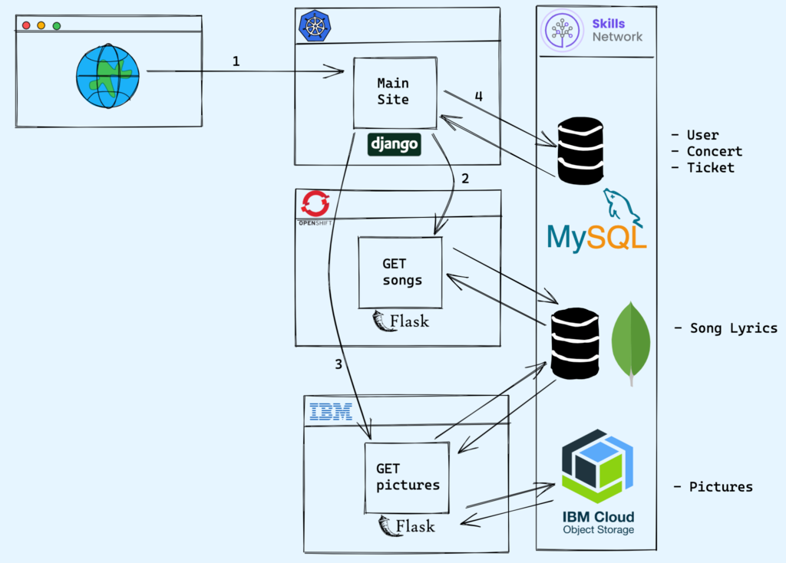

# fcs
## A repo for codespaces
- hence FCS = For Code Spaces

## Purpose(s)
1. "Host" the capstone projects for back-end development from Coursera
1. Enable coding on-the-go by having an in-browser _environment_ that can be use on a failry modern tablet pc.
1. Since the codespace is in-browser, it is essentially "multi-device" meaning I can work form any any device and not have authentication conflicts, etc

Both the Meta&trade; and IBM&trade; back-end development certificates have a capstone project 

In the IBM certifctae path, your app with have this architecture:

###### See - https://www.coursera.org/learn/backend-development-capstone-project/supplement/1PoJi/project-tasks-overview
